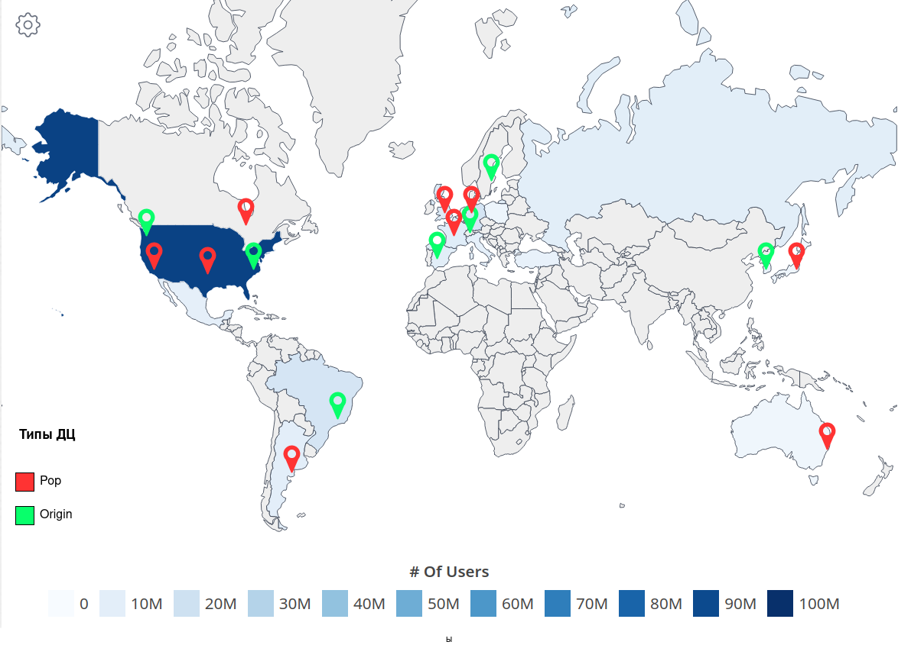

# Проект по курсу "Проектирование высоконагруженных систем".

<!--toc:start-->

- [Проект по курсу "Проектирование высоконагруженных систем".](#проект-по-курсу-проектирование-высоконагруженных-систем)
  - [1. Тема и целевая аудитория](#1-тема-и-целевая-аудитория)
    - [Целевая аудитория](#целевая-аудитория)
    - [MVP](#mvp)
  - [2. Расчет нагрузки](#2-расчет-нагрузки)
    - [2.1 Продуктовые метрики](#21-продуктовые-метрики)
      - [Среднее количество действий пользователя по типам](#среднее-количество-действий-пользователя-по-типам)
    - [2.2 Технические метрики](#22-технические-метрики)
      - [Размер хранения в разбивке по типам данных](#размер-хранения-в-разбивке-по-типам-данных)
        - [Хранилище записей трансляций](#хранилище-записей-трансляций)
        - [Промежуточное хранилище](#промежуточное-хранилище)
      - [Сетевой трафик](#сетевой-трафик)
        - [Входящий трафик](#входящий-трафик)
        - [Исходящий трафик](#исходящий-трафик)
      - [RPS в разбивке по типам запросов](#rps-в-разбивке-по-типам-запросов)
  - [3. Глобальная балансировка нагрузки](#3-глобальная-балансировка-нагрузки)
    - [3.1 Физическое расположение датацентров](#31-физическое-расположение-датацентров)
      - [Схема примерного расположения ДЦ](#схема-примерного-расположения-дц)
      - [Покрытие регионов](#покрытие-регионов)
      - [Максимальные задержки](#максимальные-задержки)
    - [3.2 Нагрузка на датацентры](#32-нагрузка-на-датацентры)
    - [3.3 Разбивка](#33-разбивка)
  - [4. Локальная балансировка нагрузки](#4-локальная-балансировка-нагрузки)
  - [5. Логическая схема БД](#5-логическая-схема-бд)
  - [6. Физическая схема БД](#6-физическая-схема-бд)
  - [7. Технологии](#7-технологии)
  - [Источники](#источники)
  <!--toc:end-->

## 1. Тема и целевая аудитория

**Twitch** – это стриминговый сервис, предназначенный для трансляции потоковых видео на игровую тематику. Сервис специализируется на играх — пользователи могут наблюдать за геймплеем, киберспортивными турнирами. Смотреть можно как онлайн, так и в записи.

### Целевая аудитория

По состоянию на август 2023 года Twitch посещает 140 миллионов уникальных пользователей каждый месяц [ \[ 1 \] ][2].

[Распределение аудитории][3]

| Страна       | Количество пользователей, млн | процент от общего количества |
| ------------ | ----------------------------- | ---------------------------- |
| США и Канада | 93                            | 36.32%                       |
| Бразилия     | 16.9                          | 6.6%                         |
| Германия     | 16.8                          | 6.56%                        |
| Англия       | 13.4                          | 5.23%                        |
| Франция      | 11.3                          | 4.41%                        |
| Россия       | 10.5                          | 4.1%                         |
| Испания      | 10.5                          | 4.1%                         |
| Аргентина    | 10                            | 3.9%                         |
| Мексика      | 9.2                           | 3.59%                        |
| Италия       | 8.3                           | 3.24%                        |
| Турция       | 7.5                           | 2.92%                        |
| Южная Корея  | 6.7                           | 2.61%                        |
| Польша       | 4.8                           | 1.87%                        |
| Япония       | 4.1                           | 1.6%                         |
| Австралия    | 4.1                           | 1.6%                         |

Большая часть аудитории приходится на Северную Америку — 39.91%. На втором месте Европа — 32.43%. На третьем месте Южная Америка — 10.5%.

### MVP

- Регистрация пользователей
- Проведение/просмотр прямых трансляций
- Просмотр закончившихся трансляций
- Подписки на пользователей
- Поиск трансляций
- Чат трансляции

## 2. Расчет нагрузки

### 2.1 Продуктовые метрики

- Месячная аудитория(MAU) — 140 млн пользователей
- Дневная аудитория(DAU) — 31 млн пользователей

#### Среднее количество действий пользователя по типам

- Средняя суммарная длительность всех трансляций за один день — 2 400 000 часов
- Среднее число трансляций в день — 1 300 000

Тогда средняя продолжительность трянсляции: $2\ 400\ 000 \div 1\ 300\ 000 \approx 2$ ч

По [статистике][4] пользователь тратит в день суммарно 95 минут на просмотр прямых трансляций на Twitch.
Можно предположить, что большинство пользователей не тратят все время на одну трансляцию, тогда в среднем пользовель посещает $\approx$ 3-4 трансляции в день и тратит на каждую около 30 минут.

На основе наблюдения за [количеством сообщений в секунду][5], можно сказать, что среднее количество примерно 600 сообщений. Тогда в день — $600 \times 60 \times 60 \times 24 \approx 52$ млн сообщений в день.

|                          | частота, млн/день | частота, на одного человека |
| :----------------------: | :---------------: | :-------------------------: |
|    Начало трансляции     |        1.1        |              -              |
| Отправка сообщения в чат |        52         |              -              |
|   Открытие трянсляции    |        2.3        |              3              |

### 2.2 Технические метрики

#### Размер хранения в разбивке по типам данных

##### Хранилище записей трансляций

На платформе Twitch срок хранения трансляции зависит от статуса пользователя.

| Категория  | срок хранения |
| :--------- | :------------ |
| Партнеры   | 60 дней       |
| Компаньоны | 14 дней       |
| Остальные  | 7 дней        |

По [статистике](https://streamscharts.com/overview/partners) общее количество партнеров Twitch составляет **63 тыс**, а общее число компаньонов — **2.1 млн**.
Пусть каждый партнер проводит 5 трансляций в неделю (в месяц примерно 24 трансляции), как указывалось выше средняя продолжительность трансляции — 2 часа, допустим, что партнеры производят больше контента, чем обычные пользователи и их трансляции длятся в **1.5 раза** больше и проводят трансляции в более хорошем качестве 1080 60fps. В этом случае битрейт будет составлять 6000kbps (по [рекомендациям][6] twitch), тогда на хранение трансляций партнеров за 2 месяца требуется:

$$
6000 \times 3 \times 60 \times 60 \times 63000 \times 48 \approx 22 \ \text{ПБайт}
$$

Для компаньонов возьмем те же характеристики, тогда на хранение трансляций компаньонов за 14 дней необходимо:

$$
6000 \times 3 \times 60 \times 60 \times 2.1 \times 10^{6} \times 10 \approx 155 \ \text{ПБайт}
$$

Для всех остальных(их примерно [14.5 млн](https://streamscharts.com/overview/partners) — в статистике учитывались только каналы с средним количеством зрителей 5 и более) возьмем следующие характеристики:

- Качество — 720p
- Частота кадров — 60fps
- Продолжительность трансляции $\approx$ 2 часа
- Количество трансляций в неделю — 4
  Итого: 213 ПБайт необходимо на хранение трансляций пользователй

$$
4500 \times 2 \times 60 \times 60 \times 4 \times 14.5 \times 10^{6} \approx 213 \ \text{ПБайт}
$$

| Категория пользователей | Размер хранилища, ПБайт |
| :---------------------- | :---------------------- |
| Партнеры                | 22                      |
| Компаньоны              | 155                     |
| Остальные               | 213                     |

##### Промежуточное хранилище

Чтобы улучшать производительность потока для зрителей нужно буфферизировать некторый отрезок трансляции. Будем буфферизировать последние **30 секунд** трансляции. [Самое большое число одновременных трансляций](https://twitchtracker.com/statistics/channels) составляет 233 935. Рассчитаем размер промежуточного хранилища, считая что трансляции ведутся в 720p 60fps с битрейтом 4500kbps.

$$
4500 \times 30 \times 234\ 000 \approx 4 \ ТБайт
$$

Получаем размер промежуточного хранилища: **4 ТБайт**

#### Сетевой трафик

##### Входящий трафик

1. Проведение трансляции

   - Дневная нагрузка:
     Как уже указывалось выше, средняя суммарная длительность всех трансляций за один день — 2 225 167 часов. Для видео в качестве 720p и частотой обновления обновления 60 fps, платформа Twitch [рекомендует][6] выставлять битрейт 4500 kbps.
     Поэтому входящая нагрузка составляет:

     $4500 \times2\ 225\ 168  \times 60 \times 60 \approx 3.6 \times 10^{13} \ \text{кбит в сутки} \approx 4 \ 250 \ 000 \ \text{ГБайт в сутки}$

   - Пиковая нагрузка:
     Из [данных](https://twitchtracker.com/statistics/channels) следует, что самое большое количество одновременно активных трансляций в течении дня составляет примерно 130 000, тогда пиковая нагрузка составляет:

     $130\ 000 \times 4500 \approx 557 ~ \text{Гбит в секунду}$

   - Средняя нагрузка:
     $93\ 000 \times 4500 \approx 399 \ \text{Гбит/сек}$

2. Отправка сообщений в чат

   - Дневная нагрузка:
     Суточное количество сообщений в чат составляет $\approx$ 52 млн сообщений.
     Допустим, символы кодируются в UTF-8, тогда на каждый символ приходится от 1 до 4 байт, возьмем средний размер — 2 байта. Пусть средняя длина сообщения составляет 20 символов, тогда нагрузка рассчитывается следующим образом:
     $52 \times 10^{6}\times 16 \times 20 \approx 12\ \text{Гбит в день}$
   - Средняя нагрузка:

     $600 \times 16 \times 20 \approx 0.002 \ \text{Гбит/сек}$

   - Пиковая нагрузка:
     Для рассчета пиковой нагрузки, умножим среднюю нагрузку на отношение пикового количества зрителей к среднему.
     $600 \times \frac{4\ 000\ 000}{2\ 337\ 099} \times 16 \times 20 \approx 0.0034 \ \text{Гбит/сек}$

##### Исходящий трафик

1. Просмотр трансляций:
   - Средняя нагрузка:
     По [данным](https://twitchtracker.com/statistics/viewers) на август 2023 года среднее количество зрителей, которые одновременно смотрят трансляции, составляет 2 401 236. На основе этого цифры можно вычислить среднюю сетевую наргрузку:
     $4500 \ \times \  2\ 401\ 236 \approx 10 \ \text{Тбит/сек}$
   - Пиковая нагрузка:
     Исходя из данных того же источника, абсолютный максимум зрителей составляет 6 647 412. Если же говорить про дневную пиковую нагрузку, то это нагрузка, которая приходится на 22:00 — 23:00 и варьируется между 3,5 млн и 4 млн. Возьмем для расчетов пиковой нагрузки верхную границу.
     $4500 \times 4\ 000 \ 000 \ = 24 \times 10^{9} \approx 17 \ \text{Тбит/сек}$
   - Дневная нагрузка:
     [Суммарное время просмотра за день](https://twitchtracker.com/statistics/watch-time) составляет 56 186 956 часов. Тогда дневная нагрузка составляет:
     $56 186 956 \times 60 \times 60 \times 4500 \approx 105965 \ \text{ТБайт/сутки}$
1. Чтение чата
   Рассчитаем среднее число зрителей на трансляцию

   $\frac{2\ 401\ 236}{93000} \approx 26\ \text{чел. на трансляцию}$

   Тогда если один человек отправляет сообщение в чат, его нужно доставить остальным зрителям, поэтому трафик для чтения чата рассчитывается следующим образом:

   - Средняя нагрузка — $26 \times 0.002 = 0.05\ \text{Гбит/сек}$
   - Дневная нагрузка — $12 \times 26 = 312\ \text{ГБайт/Сутки}$
   - Пиковая нагрузка — $\frac{4\ 000\ 000}{130\ 000} \times 0.0034 \approx 0.1 \ \text{Гбит/с}$

**Cводная таблица сетевой нагрузки:**

|       Тип запроса        | Средняя нагрузка | Пиковая нагрузка |  Дневная нагрузка  |
| :----------------------: | :--------------: | :--------------: | :----------------: |
|   Просмотр трансляции    |   10 Тбит/сек    |   17 ТБит/сек    | 105965 ТБайт/сутки |
|       Чтение чата        |   0.05 Гбит/с    |    0.1 Гбит/с    |  312 ГБайт/сутки   |
|  Проведение трансляции   |    399 Гбит/с    |    557 Гбит/с    | 4 250 ТБайт/сутки  |
| Отправка сообщений в чат |   0.002 Гбит/с   |  0.0034 Гбит/с   |  312 ГБайт/сутки   |

#### RPS в разбивке по типам запросов

Просмотр трансляции(допустим, что 5% пользователей от общего количества не смотрят ни одной транлсяции):

$$
\frac{\text{DAU} \times 0.95 \times \text{кол-во просмотренных трансляций в день} }{86400} = \frac{31 \times 10^{6}\times 0.95\times  3}{86400} \approx 1023\ \text{RPS}
$$

Проведение трансляции, учитывая, что [количество активных стримеров за день составляет примерно 1 300 000 ](https://twitchtracker.com/statistics/active-streamers)

$$
\frac{1\ 300\ 000} { 86400} \approx 15 \ \text{RPS}
$$

Количество запросов на поиск достаточно сложно подсчитать, т.к. в открытых источниках не достаточно информации. Допустим, что 30% всех пользователей пользуются поиском и делают в среднем 3 поисковых запроса в день(остальные приходят только на трансляции по уведомлениям).

$$
\frac{0.3 \times 31 \times 10^{6} \times 3}{86400} \approx 323 \ \text{RPS}
$$

Возьмем за пиковый RPS средний \* 1.7 (отношения пика зрителей к среднему количеству)

| Тип запроса         | Средний RPS | Пиковый RPS |
| :------------------ | :---------- | :---------- |
| Открытие трансляции | 1023        | 1740        |
| Отправка сообщения  | 600         | 1020        |
| Поиск               | 323         | 550         |
| Cтарт трансляции    | 15          | 26          |

## 3. Глобальная балансировка нагрузки

### 3.1 Физическое расположение датацентров

Исходя из географии аудитории представленной в пункте 1, можно сделать вывод, что большая часть аудитории приходится на Северную Америку(39%), поэтому там необходимо разместить достаточное количество ДЦ. Датацентры будут распологаться в США, прежде всего в крупных городах.

- Нью-Йорк
- Сан-Франциско
- Сиэтл
- Даллас

Так же необходимо расположить ДЦ в Канаде. Это будет город Торонто.

На Европу приходится 32% процента пользователей, причем пользователи равномерно распределены по всей территории. Поэтому расположение будет следующим:

- Лондон (северная Европа)
- Франкфурт (средняя и восточная Европе)
- Цюрих (центральная Европе)
- Париж (западная Европы)
- Стокгольм (северная Европа и Россия)
- Мадрид (южная Европа)

В Китае платформа не пользуется популярностью, в виду политики страны. Поэтому большая часть азиатской аудитории приходится на Японию и Южную Корею. Расположим ДЦ в следующих городах:

- Токио
- Сеул

Все размещенные датацентры покрывают основную часть трафика, остались не затронутыми:

- Австралия
- Южная Америка

На Бразилию и Аргентину приходится 10% пользователей. Располагаем ДЦ в следующих местах:

- Сан-Паулу
- Буэнос-Айрос

В Австралии располагается всего 1.6% пользователей, а так же с учетом плотности населения можно расположить один ДЦ в одном из крупных городов, например в городе Сидней.

#### Схема примерного расположения ДЦ

#### Покрытие регионов

#### Максимальные задержки

Составлено на основе https://wondernetwork.com/pings

|                Регион                 | Максимальная задержка(мс) |
| :-----------------------------------: | :-----------------------: |
| Сверная Америка(США, Канада, Мексика) |            50             |
|  Южная Америка (Аргентина, Бразилия)  |            40             |
|          Центральная Европа           |            47             |
|            Западная Европа            |            15             |
|      Россия (Европейская часть)       |            50             |
|      Россия (Центральная часть)       |            80             |
|        Россия (Дальний восток)        |            60             |
|       Азия(Япония, Южная Корея)       |            20             |
|               Австралия               |            45             |

### 3.2 Нагрузка на датацентры

### 3.3 Разбивка

Т.к исходящаяя нагрзука в 25 раз больше входящей, необходимо определить в каких ДЦ будут расположены сервера, принимающие входяший видеопоток, и в каких ДЦ будут находиться сервера, раздающие видеопоток конечным зрителям.

## 4. Локальная балансировка нагрузки

## 5. Логическая схема БД

- **Users**

  - Размер: $140 \times 10^6 \times (8 + 64 + 128 + 256 + 256 + 64) \approx 101 \text{ГБ}$
  - Чтение:
  - Запись:

- **Streams:** [по данным](https://twitchtracker.com/statistics/active-streamers) количество активных стримеров в день составляет от 1.1 млн до 1.4 млн. Размер данных будет рассчитывать за учитывая, что информация о трансляциях большинства пользователей храниться лишь неделю.

  - Размер: $1.4 \times 10^6 \times 7 \times (16 + 8 + 16 + 200 + 128 + 8 + 8) = 2.6 \ \text{ГБ}$
  - Чтение:
  - Запись: 16

- **Sessions**

  - Размер: будем считать, что сессия хранится действует месяц, тогда размер хранилища: $ 140 \times 10^6 \times (16 + 8 + 8) \approx 4.2 \ \text{ГБ}$
  - Чтение: $31 \times 10^6 / 86400 \approx 360$
  - Запись: -

- **Messages**

  - Размер: Запись чата трансляции хранится так же неделю $600 \times 60 \times 60 \times 24 \times 7 \times (16 + 8 + 8 + 8 + 512) \approx 187 \ \text{ГБ}$
  - Чтение: -
  - Запись: 1020

- **Follows**
  - Размер: $140 \times 10^6 \times 15 \times (16 + 8 + 8) \approx 2 \ \text{ГБ}$
  - Чтение: -
  - Запись: -

| Название таблицы | размер данных, ГБ | нагрузка на чтение | нагрузка на запись |
| ---------------- | ----------------- | ------------------ | ------------------ |
| users            | 101               | -                  | -                  |
| streams          | 2.6               | -                  | 26                 |
| follows          | 2                 | -                  | -                  |
| sessions         | 4.2               | 360                | -                  |
| messages         | 187               | -                  | 1020               |

## 6. Физическая схема БД

## 7. Технологии

## Источники

1. https://twitchtracker.com/statistics
2. https://www.demandsage.com/twitch-users/
3. https://worldpopulationreview.com/country-rankings/twitch-users-by-country
4. https://www.enterpriseappstoday.com/stats/twitch-statistics.html
5. https://stats.streamelements.com/
6. https://help.twitch.tv/s/article/broadcasting-guidelines?language=en_US
7. https://twitchstats.net/
8. https://streamscharts.com/

[1]: https://twitchtracker.com/statistics
[2]: https://www.demandsage.com/twitch-users/
[3]: https://worldpopulationreview.com/country-rankings/twitch-users-by-country
[4]: https://www.enterpriseappstoday.com/stats/twitch-statistics.html
[5]: https://stats.streamelements.com/
[6]: https://help.twitch.tv/s/article/broadcasting-guidelines?language=en_US
[7]: https://twitchstats.net/
[8]: https://streamscharts.com/
