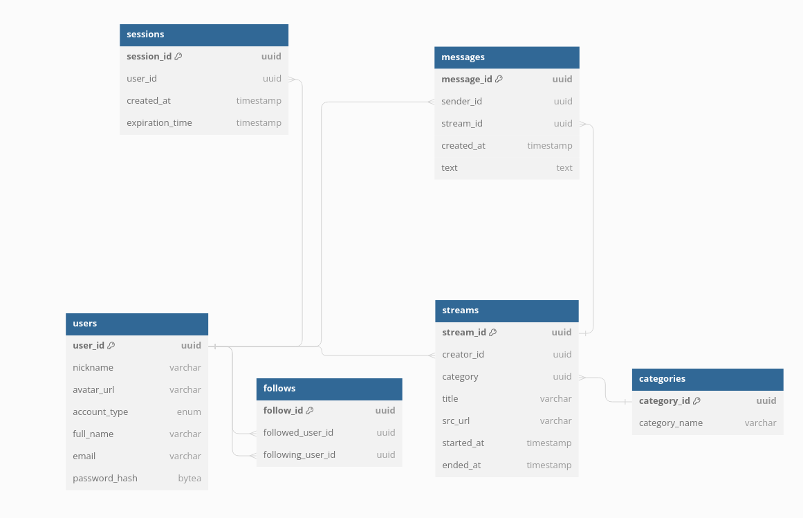
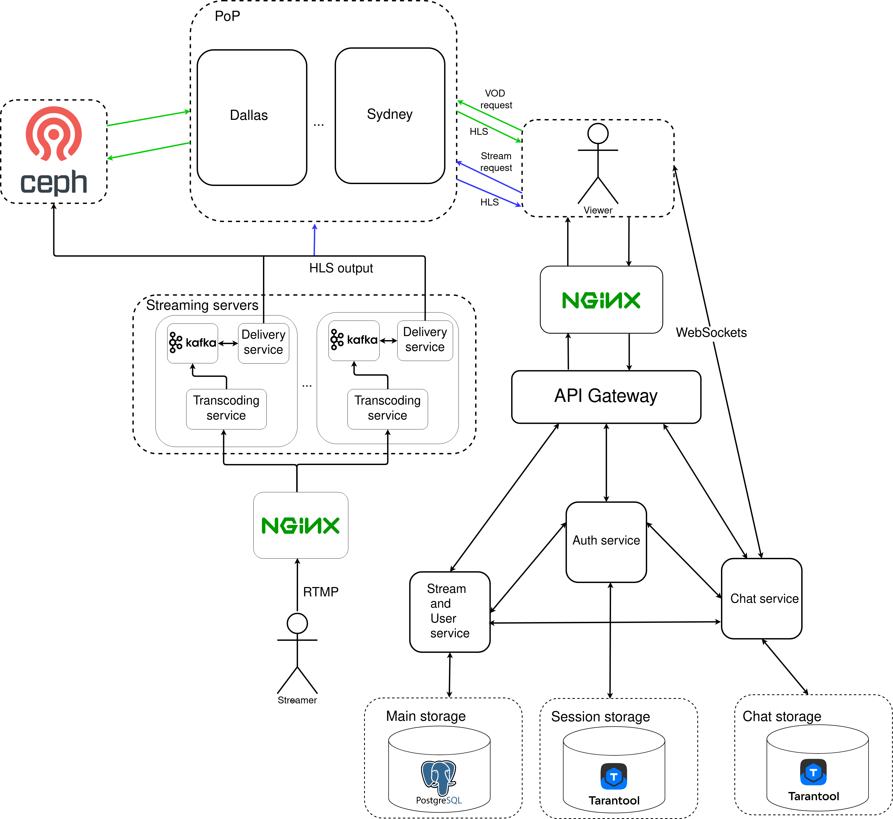

# Проект по курсу "Проектирование высоконагруженных систем".

<!--toc:start-->

- [Проект по курсу "Проектирование высоконагруженных систем".](#проект-по-курсу-проектирование-высоконагруженных-систем)
  - [1. Тема и целевая аудитория](#1-тема-и-целевая-аудитория)
    - [Целевая аудитория](#целевая-аудитория)
    - [MVP](#mvp)
  - [2. Расчет нагрузки](#2-расчет-нагрузки)
    - [2.1 Продуктовые метрики](#21-продуктовые-метрики)
      - [Среднее количество действий пользователя по типам](#среднее-количество-действий-пользователя-по-типам)
    - [2.2 Технические метрики](#22-технические-метрики)
      - [Размер хранения в разбивке по типам данных](#размер-хранения-в-разбивке-по-типам-данных)
        - [Хранилище записей трансляций](#хранилище-записей-трансляций)
        - [Промежуточное хранилище](#промежуточное-хранилище)
      - [Сетевой трафик](#сетевой-трафик)
        - [Входящий трафик](#входящий-трафик)
        - [Исходящий трафик](#исходящий-трафик)
      - [RPS в разбивке по типам запросов](#rps-в-разбивке-по-типам-запросов)
  - [3. Глобальная балансировка нагрузки](#3-глобальная-балансировка-нагрузки)
    - [GeoDNS](#geodns)
    - [3.1 Физическое расположение датацентров](#31-физическое-расположение-датацентров)
      - [Схема примерного расположения ДЦ](#схема-примерного-расположения-дц)
      - [Покрытие регионов](#покрытие-регионов)
      - [Максимальные задержки и распределение RPS](#максимальные-задержки-и-распределение-rps)
    - [3.3 Разбивка по типам серверов](#33-разбивка-по-типам-серверов)
  - [4. Локальная балансировка нагрузки](#4-локальная-балансировка-нагрузки)
    - [Отакзоустойчивость](#отакзоустойчивость)
  - [5. Логическая схема БД](#5-логическая-схема-бд)
  - [6. Физическая схема БД](#6-физическая-схема-бд)
    - [Индексы](#индексы)
  - [7. Технологии](#7-технологии)
  - [8. Схема проекта](#8-схема-проекта)
  - [9. Обеспечение надежности](#9-обеспечение-надежности)
  - [10. Рассчет ресурсов](#10-рассчет-ресурсов)
    - [Распределение ресурсов по сервисам](#распределение-ресурсов-по-сервисам)
    - [Конфигурация серверов](#конфигурация-серверов)
  - [Источники](#источники)
  <!--toc:end-->

## 1. Тема и целевая аудитория

**Twitch** – это стриминговый сервис, предназначенный для трансляции потоковых видео на игровую тематику. Сервис специализируется на играх — пользователи могут наблюдать за геймплеем, киберспортивными турнирами. Смотреть можно как онлайн, так и в записи.

### Целевая аудитория

По состоянию на август 2023 года Twitch посещает 140 миллионов уникальных пользователей каждый месяц [ \[ 1 \] ][2].

[Распределение аудитории][3]

| Страна       | Количество пользователей, млн | процент от общего количества |
| ------------ | ----------------------------- | ---------------------------- |
| США и Канада | 93                            | 36.32%                       |
| Бразилия     | 16.9                          | 6.6%                         |
| Германия     | 16.8                          | 6.56%                        |
| Англия       | 13.4                          | 5.23%                        |
| Франция      | 11.3                          | 4.41%                        |
| Россия       | 10.5                          | 4.1%                         |
| Испания      | 10.5                          | 4.1%                         |
| Аргентина    | 10                            | 3.9%                         |
| Мексика      | 9.2                           | 3.59%                        |
| Италия       | 8.3                           | 3.24%                        |
| Турция       | 7.5                           | 2.92%                        |
| Южная Корея  | 6.7                           | 2.61%                        |
| Польша       | 4.8                           | 1.87%                        |
| Япония       | 4.1                           | 1.6%                         |
| Австралия    | 4.1                           | 1.6%                         |

Большая часть аудитории приходится на Северную Америку — 39.91%. На втором месте Европа — 32.43%. На третьем месте Южная Америка — 10.5%.

### MVP

- Регистрация пользователей
- Проведение/просмотр прямых трансляций
- Просмотр закончившихся трансляций
- Подписки на пользователей
- Поиск трансляций
- Чат трансляции

## 2. Расчет нагрузки

### 2.1 Продуктовые метрики

- Месячная аудитория(MAU) — 140 млн пользователей
- Дневная аудитория(DAU) — 31 млн пользователей

#### Среднее количество действий пользователя по типам

- Средняя суммарная длительность всех трансляций за один день — 2 400 000 часов
- Среднее число трансляций в день — 1 300 000

Тогда средняя продолжительность трянсляции: $2\ 400\ 000 \div 1\ 300\ 000 \approx 2$ ч

По [статистике][4] пользователь тратит в день суммарно 95 минут на просмотр прямых трансляций на Twitch.
Можно предположить, что большинство пользователей не тратят все время на одну трансляцию, тогда в среднем пользовель посещает $\approx$ 3-4 трансляции в день и тратит на каждую около 30 минут.

На основе наблюдения за [количеством сообщений в секунду][5], можно сказать, что среднее количество примерно 600 сообщений. Тогда в день — $600 \times 60 \times 60 \times 24 \approx 52$ млн сообщений в день.

|                          | частота, млн/день |
| :----------------------: | :---------------: |
|    Начало трансляции     |        1.1        |
| Отправка сообщения в чат |        52         |
|   Открытие трянсляции    |        2.3        |

### 2.2 Технические метрики

#### Размер хранения в разбивке по типам данных

##### Хранилище записей трансляций

На платформе Twitch срок хранения трансляции зависит от статуса пользователя.

| Категория  | срок хранения |
| :--------- | :------------ |
| Партнеры   | 60 дней       |
| Компаньоны | 14 дней       |
| Остальные  | 7 дней        |

По [статистике](https://streamscharts.com/overview/partners) общее количество партнеров Twitch составляет **63 тыс**, компаньонов — **2.1 млн**, останльных - **14.5 млн**. Каждый день проводиться около 1.3 \* 10^6 трансляций. Вычислим сколько трансляций в день проводит каждая из категорий.

Партнеры:

$$
	\frac{63 \times 10^3}{63 \times 10^3 + 2.1 \times 10^6 + 14.5 \times 10^6} \times 1.3 \times 10^6 \approx 4915
$$

Компаньоны:

$$
	\frac{2.1 \times 10^6}{63 \times 10^3 + 2.1 \times 10^6 + 14.5 \times 10^6} \times 1.3 \times 10^6 \approx 163836
$$

Остальные:

$$
\frac{14.5 \times 10^6}{63 \times 10^6 + 2.1 \times 10^6 + 14.5 \times 10^6} \times 1.3 \times 10^6 \approx 1131249
$$

Объем диска для партнеров:

$$
4915 \times 6000 \times 2 \times 60 \times 60 \times 60 \approx 1.45 \ \text{PB}
$$

Объем диска для компаньонов:

$$
163836 \times 6000 \times 2 \times 60 \times 60 \times 14 \approx 11.27 \ \text{PB}
$$

Объем диска для остальных:

$$
1131249 \times 6000 \times 2 \times 60 \times 60 \times 7 \approx 39 \ \text{PB}
$$

| Категория  | Размер хранилища, ПБ |
| :--------- | :------------------- |
| Партнеры   | 1.45                 |
| Компаньоны | 11.27                |
| Остальные  | 39                   |

**Суммарный объем хранилища:** 51.72 ПБ

##### Промежуточное хранилище

Чтобы улучшать производительность потока для зрителей нужно буфферизировать некторый отрезок трансляции. Будем буфферизировать последние **30 секунд** трансляции. [Самое большое число одновременных трансляций](https://twitchtracker.com/statistics/channels) составляет 233 935. Рассчитаем размер промежуточного хранилища, считая что трансляции ведутся в 1080p 30fps с битрейтом 4500kbps.

$$
4500 \times 30 \times 234\ 000 \approx 4 \ ТБайт
$$

Получаем размер промежуточного хранилища: **4 ТБайт**

#### Сетевой трафик

##### Входящий трафик

1. Проведение трансляции

   - Дневная нагрузка:
     Как уже указывалось выше, средняя суммарная длительность всех трансляций за один день — 2 225 167 часов. Для видео в качестве 720p и частотой обновления обновления 60 fps, платформа Twitch [рекомендует][6] выставлять битрейт 4500 kbps.
     Поэтому входящая нагрузка составляет:

     $4500 \times2\ 225\ 168  \times 60 \times 60 \approx 3.6 \times 10^{13} \ \text{кбит в сутки} \approx 4 \ 250 \ 000 \ \text{ГБайт в сутки}$

   - Пиковая нагрузка:
     Из [данных](https://twitchtracker.com/statistics/channels) следует, что самое большое количество одновременно активных трансляций в течении дня составляет примерно 130 000, тогда пиковая нагрузка составляет:

     $130\ 000 \times 4500 \approx 557 ~ \text{Гбит в секунду}$

   - Средняя нагрузка:
     $93\ 000 \times 4500 \approx 399 \ \text{Гбит/сек}$

2. Отправка сообщений в чат

   - Дневная нагрузка:
     Суточное количество сообщений в чат составляет $\approx$ 52 млн сообщений.
     Допустим, символы кодируются в UTF-8, тогда на каждый символ приходится от 1 до 4 байт, возьмем средний размер — 2 байта. Пусть средняя длина сообщения составляет 20 символов, тогда нагрузка рассчитывается следующим образом:
     $52 \times 10^{6}\times 16 \times 20 \approx 12\ \text{Гбит в день}$
   - Средняя нагрузка:

     $600 \times 16 \times 20 \approx 0.002 \ \text{Гбит/сек}$

   - Пиковая нагрузка:
     Для рассчета пиковой нагрузки, умножим среднюю нагрузку на отношение пикового количества зрителей к среднему.
     $600 \times \frac{4\ 000\ 000}{2\ 337\ 099} \times 16 \times 20 \approx 0.0034 \ \text{Гбит/сек}$

##### Исходящий трафик

1. Просмотр трансляций:
   - Средняя нагрузка:
     По [данным](https://twitchtracker.com/statistics/viewers) на август 2023 года среднее количество зрителей, которые одновременно смотрят трансляции, составляет 2 401 236. На основе этого цифры можно вычислить среднюю сетевую наргрузку:
     $4500 \ \times \  2\ 401\ 236 \approx 10 \ \text{Тбит/сек}$
   - Пиковая нагрузка:
     Исходя из данных того же источника, абсолютный максимум зрителей составляет 6 647 412. Если же говорить про дневную пиковую нагрузку, то это нагрузка, которая приходится на 22:00 — 23:00 и варьируется между 3,5 млн и 4 млн. Возьмем для расчетов пиковой нагрузки верхную границу.
     $4500 \times 4\ 000 \ 000 \ = 24 \times 10^{9} \approx 17 \ \text{Тбит/сек}$
   - Дневная нагрузка:
     [Суммарное время просмотра за день](https://twitchtracker.com/statistics/watch-time) составляет 56 186 956 часов. Тогда дневная нагрузка составляет:
     $56 186 956 \times 60 \times 60 \times 4500 \approx 105965 \ \text{ТБайт/сутки}$
1. Чтение чата
   Рассчитаем среднее число зрителей на трансляцию

   $\frac{2\ 401\ 236}{93000} \approx 26\ \text{чел. на трансляцию}$

   Тогда если один человек отправляет сообщение в чат, его нужно доставить остальным зрителям, поэтому трафик для чтения чата рассчитывается следующим образом:

   - Средняя нагрузка — $26 \times 0.002 = 0.05\ \text{Гбит/сек}$
   - Дневная нагрузка — $12 \times 26 = 312\ \text{ГБайт/Сутки}$
   - Пиковая нагрузка — $\frac{4\ 000\ 000}{130\ 000} \times 0.0034 \approx 0.1 \ \text{Гбит/с}$

**Cводная таблица сетевой нагрузки:**

|       Тип запроса        |       Средняя нагрузка        |        Пиковая нагрузка        |  Дневная нагрузка  |
| :----------------------: | :---------------------------: | :----------------------------: | :----------------: |
|   Просмотр трансляции    | 10 Тбит/сек(2.4 млн зрителей) |  17 ТБит/сек (4 млн зрителей)  | 105965 ТБайт/сутки |
|       Чтение чата        |          0.05 Гбит/с          |           0.1 Гбит/с           |  312 ГБайт/сутки   |
|  Проведение трансляции   | 399 Гбит/с(93000 трансляций)  | 557 Гбит/с (130000 трансляций) | 4 250 ТБайт/сутки  |
| Отправка сообщений в чат |         0.002 Гбит/с          |         0.0034 Гбит/с          |  312 ГБайт/сутки   |

#### RPS в разбивке по типам запросов

Просмотр трансляции(допустим, что 5% пользователей от общего количества не смотрят ни одной транлсяции):

$$
\frac{\text{DAU} \times 0.95 \times \text{кол-во просмотренных трансляций в день} }{86400} = \frac{31 \times 10^{6}\times 0.95\times  3}{86400} \approx 1023\ \text{RPS}
$$

Проведение трансляции, учитывая, что [количество активных стримеров за день составляет примерно 1 300 000 ](https://twitchtracker.com/statistics/active-streamers)

$$
\frac{1\ 300\ 000} { 86400} \approx 15 \ \text{RPS}
$$

Количество запросов на поиск достаточно сложно подсчитать, т.к. в открытых источниках не достаточно информации. Допустим, что 30% всех пользователей пользуются поиском и делают в среднем 3 поисковых запроса в день(остальные приходят только на трансляции по уведомлениям).

$$
\frac{0.3 \times 31 \times 10^{6} \times 3}{86400} \approx 323 \ \text{RPS}
$$

Количество запросов на загрузку чанка рассчитаем как отношение исходящей нагрузки на просмотр трансляций к размер чанка длиной 2 секунды.

Возьмем за пиковый RPS средний \* 1.7 (отношения пика зрителей к среднему количеству)

| Тип запроса                      | Средний RPS  | Пиковый RPS  |
| :------------------------------- | :----------- | :----------- |
| Открытие трансляции              | 1023         | 1740         |
| Загрузка чанка трансляции(2 сек) | $1.1 * 10^6$ | $1.8 * 10^6$ |
| Отправка сообщения               | 600          | 1020         |
| Поиск                            | 323          | 550          |
| Cтарт трансляции                 | 15           | 26           |

## 3. Глобальная балансировка нагрузки

### GeoDNS

Определения ДЦ для обработки запроса будет осуществляться с помощью GeoDNS.
DNS-сервер **Bind** [предоставляет](https://kb.isc.org/docs/aa-01149)
возможность использовать базу данных GeoIP2 для определения географического положения клиента.
Таким образом, DNS сервер используя GeoIP, будет предоставлять различные IP-адреса в ответ на запросы от клиентов в зависимости от их физического местоположения.

### 3.1 Физическое расположение датацентров

Исходя из географии аудитории представленной в пункте 1, можно сделать вывод, что большая часть аудитории приходится на Северную Америку(39%), поэтому там необходимо разместить достаточное количество ДЦ. Датацентры будут распологаться в США, прежде всего в крупных городах.

- Нью-Йорк
- Сан-Франциско
- Сиэтл
- Даллас

Так же необходимо расположить ДЦ в Канаде. Это будет город Торонто.

На Европу приходится 32% процента пользователей, причем пользователи равномерно распределены по всей территории. Поэтому расположение будет следующим:

- Лондон (северная Европа)
- Франкфурт (средняя и восточная Европе)
- Цюрих (центральная Европе)
- Париж (западная Европы)
- Стокгольм (северная Европа и Россия)
- Мадрид (южная Европа)

В Китае платформа не пользуется популярностью, в виду политики страны. Поэтому большая часть азиатской аудитории приходится на Японию и Южную Корею. Расположим ДЦ в следующих городах:

- Токио
- Сеул

Все размещенные датацентры покрывают основную часть трафика, остались не затронутыми:

- Австралия
- Южная Америка

На Бразилию и Аргентину приходится 10% пользователей. Располагаем ДЦ в следующих местах:

- Сан-Паулу
- Буэнос-Айрос

В Австралии располагается всего 1.6% пользователей, а так же с учетом плотности населения можно расположить один ДЦ в одном из крупных городов, например в городе Сидней.

#### Схема примерного расположения ДЦ

#### Покрытие регионов

#### Максимальные задержки и распределение RPS

Составлено на основе https://wondernetwork.com/pings

|                Регион                 | Максимальная задержка(мс) |
| :-----------------------------------: | :-----------------------: |
| Сверная Америка(США, Канада, Мексика) |            50             |
|  Южная Америка (Аргентина, Бразилия)  |            40             |
|          Центральная Европа           |            47             |
|            Западная Европа            |            15             |
|      Россия (Европейская часть)       |            50             |
|      Россия (Центральная часть)       |            80             |
|        Россия (Дальний восток)        |            60             |
|       Азия(Япония, Южная Корея)       |            20             |
|               Австралия               |            45             |

| Расположение  | Нагрузка, RPS | Сетевая нагрузка(просмотр трансляции), Tб/с | Сетевая нагрузка(проведение трансляции), Гб/с |
| ------------- | ------------- | ------------------------------------------- | --------------------------------------------- |
| Нью-Йорк      | 130477        | 1.3                                         | 52                                            |
| Сан-Франциско | 85291         | 0.71                                        | 28.4                                          |
| Сиэтл         | 56207         | 0.47                                        | 18.8                                          |
| Даллас        | 152248        | 1.5                                         | 60                                            |
| Торонто       | 42258         | 0.35                                        | 14                                            |
| Лондон        | 57565         | 0.48                                        | 19.8                                          |
| Франкфурт     | 125703        | 1.46                                        | 58                                            |
| Цюрих         | 101036        | 0.84                                        | 33.6                                          |
| Париж         | 48166         | 0.4                                         | 16                                            |
| Стокгольм     | 56390         | 0.47                                        | 20                                            |
| Мадрид        | 56390         | 0.47                                        | 20                                            |
| Токио         | 17631         | 0.16                                        | 6.4                                           |
| Сеул          | 28779         | 0.26                                        | 10.4                                          |
| Сан-Паулу     | 726133        | 0.66                                        | 26.4                                          |
| Буэнос-Айрос  | 42977         | 0.39                                        | 15.6                                          |
| Сидней        | 17632         | 0.16                                        | 6.4                                           |

### 3.3 Разбивка по типам серверов

Т.к исходящаяя нагрзука в 25 раз больше входящей, необходимо определить какие из ДЦ будут Origin, а какие PoP.

- Функция Origin - обработка видеопотока от PoP и конечных пользователей.
- Функция PoP - прием видеопотока от пользователей и перенаправление его в Origin.

## 4. Локальная балансировка нагрузки

Для балансировки нагрузки внутри ДЦ будем использовать L7 балансировщик, например Envoy.
Запросы на ведение трансляции будут распределяться с помощью consistant hash от id трансляции, так можно добиться того, чтобы все чанки уходили на один сервер.
При смене источника трансляции(например с компьютера на телефон) id трансляции останется тем же, и видеопоток будет приходить на тот же сервер.
Остальные запросы будут балансироваться с помощью алгоритма Weighted Round Robin.

### Отакзоустойчивость

Для оркестрации будет использоваться Kubernetes. Kubernetes предоставляет набор проб, позволяющих контролировать
состояние подов, и в случае неудачных проб Kubernetes будет пытаться переподнять поды.
Таким образом будет осуществляться контроль того, какие поды будут использованы в качестве бекенда для сервиса.
Пока под не в статусе ready, он будет исключен из балансировщиков нагрузки сервиса.

- **liveness** - позволяет отследить доступность работающего приложения, посредством отправления HTTP запроса. Запрос отправляется каждые 5 секунд.
  Пример конфига для включения liveness пробы.

- **readiness** - позволяет отследить готовность контейнреа принимать трафик. Под считается готовым, когда готовы все его контейнеры.
  Пример конфига для включения readiness пробы

Также будет использоваться Service mesh архитектура. В качестве реализации - Istio.
При использовании service mesh архитектуры, рядом с каждым сервисом ставится прокси сервер, который называется sidecar-proxy.
В случае Istio в качестве sidecar-proxy используется Envoy.

Механизмы Istio для обеспечения надежности (примеры конфигов лежат в папке `./samples`):

- **Circuit Breaking:**. С помощью прерываний можно предотвратить запросы к сервису, который испытывает проблемы.

- **Timeouts:** позволяет предотвратить блокировку ресурсов на стороне отправителя и получателя.
  Если ответ от сервиса не поступает в течение определенного времени, Istio может прекращать ожидание и обрабатывать ситуацию

- **Retries:** Istio может автоматически повторять неудачные запросы, что может улучшить надежность системы в случае временных сбоев.

- **Rate Limiting:** Istio поддерживает упр��вление частотой запросов, что позволяет предотвращать перегрузки сервисов за счет ограничения количества запросов, поступающих на них.

## 5. Логическая схема БД

**Users**

    16 + 64 + 128 + 256 + 256 + 64 = 0.8 КБ

**Streams**

    16 + 16 + 16 + 128 + 128 + 8 + 8 = 0.31 КБ

**Sessions**

    16 + 16 + 8 + 8 = 0.05 КБ

**Messages**

    16 + 16 + 16 + 8 + 512 = 0.55 КБ

**Follows**

    16 + 16 + 16 = 0.05 КБ

**Categories**

    16 + 256 = 0.27 КБ

| Название таблицы | размер данных, ГБ | нагрузка на чтение | нагрузка на запись       |
| ---------------- | ----------------- | ------------------ | ------------------------ |
| users            | 101               | 358                | 14571 (дневная нагрузка) |
| streams          | 2.6               | 4933               | 26                       |
| follows          | 66                | 358                | 1157                     |
| sessions         | 6.7               | 1076               | -                        |
| messages         | 192               | -                  | 1020                     |

Нагрузка на чтение сообщений незначительная, т.к сообщения пересылаются сразу всем
активным зрителям трансляции, чат доступен только с того момента, как зритель присоединился к трансляции.

Наг��узка запись в **follows** рассчитана на основе [данных о приросте подписчиков за последние 30 дней](https://twitchtracker.com/channels/followers-growth).

## 6. Физическая схема БД

### Индексы

**Users**

| Ключи индекса | Тип индекса | Размер, ГБ |
| ------------- | ----------- | ---------- |
| user_id       | BTree       | 0.3        |
| nickname      | BTree       | 9.4        |

**Follows**

| Ключи индекса    | Тип индекса | Размер, ГБ |
| ---------------- | ----------- | ---------- |
| follow_id        | BTree       | 31         |
| followed_user_id | Hash        | 15         |

**Categories**

| Ключи индекса | Тип индекса | Размер, ГБ |
| ------------- | ----------- | ---------- |
| category_id   | BTree       | 0.0002     |

**Messages**

| Ключи индекса | Тип индекса | Размер, ГБ |
| ------------- | ----------- | ---------- |
| message_id    | BTree       | 8          |
| stream_id     | BTree       | 8          |

**Streams**

| Ключи индекса | Тип индекса | Размер, ГБ |
| ------------- | ----------- | ---------- |
| stream_id     | BTree       | 0.2        |
| title         | BTree       | 1.1        |
| category_id   | Hash        | 0.2        |

## 7. Технологии

| Технология   | Применение                                | Обоснование                                                                                |
| ------------ | ----------------------------------------- | ------------------------------------------------------------------------------------------ |
| Go           | Основной язык бекенда                     | Простота написания, параллелизм из коробки, удобные инструменты для отладки и тестирования |
| Typescript   | Основной язык фронтенда                   | Типизация, отлов ошибок на этапе компилаяции                                               |
| React        | Фронтенд фреймворк                        | Скорость написание, активное сообщество, компонентный подход                               |
| Nginx        | L7 балансировщик                          | Активное сообщество                                                                        |
| Envoy        | Sidecar proxy                             | нативный прокси в Istio                                                                    |
| RTMP         | Протокол стриминга                        | Поддержка со стороны популярных программ для потокового вещания.                           |
| HLS          | Протокол стриминга                        | Поддержка адаптивного битрейта.                                                            |
| Ceph         | Хранение видеочанков                      | Масштабируемость, высокая отказоустойчивость                                               |
| Clickhouse   | Хранение логов                            | Горизонтальная масштабируемость, отказоустойчивость                                        |
| Apache Kafka | Брокер сообщений                          | Надежность, высокая пропускная способность                                                 |
| Tarantool    | Хранение сессий, чата активных трансляций | Высокая производительность, совместимость с golang                                         |
| PostgreSQL   | Долговременное хранение данных            | Масштабируемость, высокая надежность.                                                      |

## 8. Схема проекта

## 9. Обеспечение надежности

При большой нагрузке на просмотр постепенно понижаем максимально качество исходящих видеопотоков.
Вычислительные ресурсы на обработку входящего видеопотока в первую очередь отдаются партнерам и компаньонам, а потом обычным стримерам
(Twitch так и поступает, иногда при просмотре трансляции не крупного стримера, можно заметить, что качество трансляции ограниченно 720p)

| БД         | Способ обеспечения надежности                                                                                                           |
| ---------- | --------------------------------------------------------------------------------------------------------------------------------------- |
| PostgreSQL | асинхронная Master-Slave репликация с использованием Patroni и etcd для автоматической смены Master узла в случае его отказа            |
| Kafka      | Репликация с фактором репликации 3.                                                                                                     |
| Tarantool  | Master-Master репликация c полной ячеистой топологией                                                                                   |
| Ceph       | Репликация данных с фактором репликации 3. Минимальное число OSD для подтверждения успешного сохранения - 2(главный OSD и одна реплика) |

| Сервис            | Расположение                           | Замечания                                                                                                                                                                        |
| ----------------- | -------------------------------------- | -------------------------------------------------------------------------------------------------------------------------------------------------------------------------------- |
| Ceph-MON          | Все датацентры                         | В каждом ДЦ располагается по серверу с Ceph-MON. В одном из ДЦ ставим два инстанса(например в Нью-Йорке), т.к всего ДЦ - 16. Нечетное количество нужно для избежания split-brain |
| Ceph-OSD          | Все датацентры                         | Располагается в каждом ДЦ, примерно в равном количестве серверов                                                                                                                 |
| PostgreSQL        | Все датацентры                         | Master распологается в ДЦ Нью-Йорк, в остальных ДЦ асинхронные реплики.                                                                                                          |
| Tarantool         | Все датацентры                         | Располагается в каждом ДЦ для улучшения надежности хранения сообщений                                                                                                            |
| Transocding       | Во всех Origin ДЦ                      | -                                                                                                                                                                                |
| Delivery          | Во всех Origin ДЦ                      | -                                                                                                                                                                                |
| Auth              | Несколько экземпляров в каждом регионе | В каждом регионе по два экземпляра в разных ДЦ                                                                                                                                   |
| Streams and Users | Несколько экземпляров в каждом регионе | В каждом регионе по два экземпляра в разных ДЦ                                                                                                                                   |
| Chat              | Несколько экземпляров в каждом регионе | В каждом регионе по два экземпляра в разных ДЦ                                                                                                                                   |
| Edge              | Все датацентры                         | -                                                                                                                                                                                |
| Ingest            | Все датацентры                         | -                                                                                                                                                                                |

### Распределение серверов по датацентрам

## 10. Рассчет ресурсов

### Распределение ресурсов по сервисам

Для рассчета ресурсов под сервис транскодирования возьмем данные из \[[10]\]
Для рассчета ресурсов под сервис чата возьмем данные из \[[11]\]

| Сервис                    | Целевая пиковая нагрузка приложения | CPU   | RAM     | Net      | GPU  |
| ------------------------- | ----------------------------------- | ----- | ------- | -------- | ---- |
| Edge(раздача видеопотока) | 1.8 \* 10^6 RPS                     | 730   | 36 ГБ   | 17 Тб/с  | -    |
| Ingest(прием видеопотока) | 130000 Connections                  | 100   | 20 ГБ   | 557 Гб/с | -    |
| API Gateway               | 3392 RPS                            | 330   | 30 ГБ   | 20 ГБ/с  | -    |
| Transcoding               | 130000 Parallel streams             | 22690 | -       | 557 ГБ/с | 2960 |
| Streams and Users         | 2316 RPS                            | 200   | 23 ГБ   | 10 Гб/с  | -    |
| Auth                      | 1076 RPS                            | 108   | 10 ГБ   | 2 Гб/c   | -    |
| Delivery                  | 130000 Parallel Streams             | 5200  | 558 ГБ  | 4 Тб/с   | -    |
| Chat                      | 4 \* 10^6 Connections               | 1340  | 1178 ГБ | 3 Гб/с   | -    |

### Конфигурация серверов

| Сервис                    | Хостинг | Конфигурация                                  | GPU                 | Cores | Cnt | Цена    |
| ------------------------- | ------- | --------------------------------------------- | ------------------- | ----- | --- | ------- |
| Edge(раздача видеопотока) | own     | 1x6448Y/2x32GB/2xNVMe8T/1x50Gb/s              | -                   | 32    | 435 | €9,493  |
| Ingest(прием видеопотока) | own     | 1x6448Y/2x16GB/1xNVMe256GB/1x25Gb/s           | -                   | 32    | 30  | €7,715  |
| Auth                      | own     | 1x6448Y/2x16GB/1xNVMe256GB/1x10GB/s           | -                   | 32    | 10  | €7,688  |
| Streams and Users         | own     | 1x6448Y/2x16GB/1xNVMe256GB/1x10GB/s           | -                   | 32    | 8   | €7,688  |
| Transcoding               | own     | 2x6421N/16x32GB/1xNVMe256GB/1x10Gb/s          | 8 x NVIDIA Tesla L4 | 64    | 370 | €38,566 |
| Delivery                  | own     | 2x6448Y/2x32GB/1xNVMe256GB/1x50Gb/s           | -                   | 64    | 102 | €13,263 |
| Chat                      | own     | 1x6448Y/2x16GB/1xNVMe256GB/1x10Gb/s           | -                   | 32    | 42  | €7,688  |
| API Gateway               | own     | 1x6448Y/2x16GB/1xNVMe256GB/1x25Gb/s           | -                   | 32    | 12  | €7,715  |
| Балансировщики            | own     | 1x6448Y/2x16GB/1xNVMe256GB/1x25Gb/s           | -                   | 32    | 16  | €7,715  |
| Tarantool                 | own     | 1x6418H/8x64GB/1xNVMe512GB/1x25Gb/s           | -                   | 24    | 16  | €7,708  |
| PostgreSQL                | own     | 1x6418H/4x32GB/2xHDD2TB/1x10GB/s              | -                   | 24    | 32  | €6,143  |
| Kafka                     | own     | 2x5318N/8x32GB/2xSSD1.9TB/1x10GB/s            | -                   | 64    | 21  | €9,015  |
| Ceph-MON                  | own     | 1x6430/8x32GB/1xNVMe512GB/1x25Gb/s            | -                   | 32    | 17  | €6,161  |
| Ceph-OSD                  | own     | 1x6338/8x32GB/1xNVMe960GB/36xHDD20TB/1x25Gb/s | -                   | 32    | 225 | €23,192 |

## Источники

1. https://twitchtracker.com/statistics
2. https://www.demandsage.com/twitch-users/
3. https://worldpopulationreview.com/country-rankings/twitch-users-by-country
4. https://www.enterpriseappstoday.com/stats/twitch-statistics.html
5. https://stats.streamelements.com/
6. https://help.twitch.tv/s/article/broadcasting-guidelines?language=en_US
7. https://twitchstats.net/
8. https://streamscharts.com/
9. https://blog.twitch.tv/en/2022/04/26/ingesting-live-video-streams-at-global-scale/
10. https://www.wowza.com/docs/wowza-transcoder-performance-benchmark
11. https://www.nginx.com/blog/nginx-websockets-performance/
12. https://docs.ceph.com/en/reef/start/hardware-recommendations/

[1]: https://twitchtracker.com/statistics
[2]: https://www.demandsage.com/twitch-users/
[3]: https://worldpopulationreview.com/country-rankings/twitch-users-by-country
[4]: https://www.enterpriseappstoday.com/stats/twitch-statistics.html
[5]: https://stats.streamelements.com/
[6]: https://help.twitch.tv/s/article/broadcasting-guidelines?language=en_US
[7]: https://twitchstats.net/
[8]: https://streamscharts.com/
[9]: https://blog.twitch.tv/en/2022/04/26/ingesting-live-video-streams-at-global-scale/
[10]: https://www.wowza.com/docs/wowza-transcoder-performance-benchmark
[11]: https://www.nginx.com/blog/nginx-websockets-performance/
[12]: https://docs.ceph.com/en/reef/start/hardware-recommendations/
